<div align="center">

[discord-shield]: https://img.shields.io/discord/1313385177703256064?logo=%235865F2&label=Discord
[discord-url]: https://discord.gg/djJUs48Zbu
[stars-shield]: https://img.shields.io/github/stars/pkgforge/soarpkgs.svg
[stars-url]: https://github.com/pkgforge/soarpkgs/stargazers
[issues-shield]: https://img.shields.io/github/issues/pkgforge/soarpkgs.svg
[issues-url]: https://github.com/pkgforge/soarpkgs/issues
[license-shield]: https://img.shields.io/github/license/pkgforge/soarpkgs.svg
[license-url]: https://github.com/pkgforge/soarpkgs/blob/main/LICENSE
[doc-shield]: https://img.shields.io/badge/docs.pkgforge.dev-blue
[doc-url]: https://docs.pkgforge.dev/repositories/soarpkgs

<a href="https://pkgs.pkgforge.dev/?repo=soarpkgs"></a>
<a href="https://pkgs.pkgforge.dev"></a>
[![Discord][discord-shield]][discord-url]
[![Documentation][doc-shield]][doc-url]
[![Issues][issues-shield]][issues-url]
[![License: MIT][license-shield]][license-url]
[![Stars][stars-shield]][stars-url]
</div>

<p align="center"> 
    <!--<a href="https://github.com/pkgforge/soar">
        
    </a><br>
    <!--<a href="https://github.com/pkgforge/soar">
        
    </a><br> -->
    <b><strong> <a href="https://pkgs.pkgforge.dev/?repo=soarpkgs">The true, simple & suckless Linux User Repository</a></code></strong></b>
    <br> 
</p>

---
- This repository hosts [`.SBUILD` Recipes](https://docs.pkgforge.dev/sbuild/introduction) used to build [Binaries](https://docs.pkgforge.dev/formats/binaries) & [Packages](https://docs.pkgforge.dev/formats/packages) for [Soar](https://github.com/pkgforge/soar)
```bash
.
├── assets --> Common Assets used by other Packages
├── binaries --> SBUILDs of type: https://docs.pkgforge.dev/formats/binaries
├── packages --> SBUILDs of type: https://docs.pkgforge.dev/formats/packages
└── templates --> SBUILD examples & templates for common formats

!# $file.disabled --> Needs fixing & rewriting
```

> [!NOTE]
> We recommend cloning with [`--filter=blob:none`](https://github.blog/open-source/git/get-up-to-speed-with-partial-clone-and-shallow-clone/) for local development<br>
> Package Listing & Searching: https://pkgs.pkgforge.dev/?repo=soarpkgs

---
#### Index
- [**📖 Docs & FAQs 📖**](https://docs.pkgforge.dev/repositories/soarpkgs)
> - [**`What is this?`**](https://docs.pkgforge.dev/repositories/soarpkgs)
> - [**`What is an .SBUILD Recipe`**](https://docs.pkgforge.dev/sbuild/introduction)
> - [**`How to Write an .SBUILD Recipe`**](https://docs.pkgforge.dev/sbuild/instructions)
> - [**`How to Build & Install an .SBUILD Recipe`**](https://docs.pkgforge.dev/sbuild/instructions#build)
> - [**`Contribution Guidelines`**](https://docs.pkgforge.dev/repositories/soarpkgs/contribution)
> - [**`Request a New Package`**](https://docs.pkgforge.dev/repositories/soarpkgs/package-request)
> - [**`Differences from BinCache/PkgCache`**](https://docs.pkgforge.dev/repositories/soarpkgs/differences)
> - **`Requirements to add a PKG to` [`BinCache`](https://docs.pkgforge.dev/repositories/bincache/package-request)`/`[`PkgCache`](https://docs.pkgforge.dev/repositories/pkgcache/package-request)**
> - [**`DMCA/Copyright/PKG Removal`**](https://docs.pkgforge.dev/repositories/soarpkgs/dmca-or-copyright-cease-and-desist)
> - [**`Is this really an AUR..?`**](https://docs.pkgforge.dev/repositories/soarpkgs/faq#is-this-really-an-aur)
> - [**`FAQs`**](https://docs.pkgforge.dev/repositories/soarpkgs/faq)
> - [**`Security`**](https://docs.pkgforge.dev/repositories/soarpkgs/security)
> - [**`Contact Us`**](https://docs.pkgforge.dev/contact/chat)
- [**Community 💬**](https://docs.pkgforge.dev/contact/chat)
> - <a href="https://discord.gg/djJUs48Zbu"><code>PkgForge () Discord </code></a> `➼` [`https://discord.gg/djJUs48Zbu`](https://discord.gg/djJUs48Zbu)

---
#### Package Stats
> [!NOTE]
> ℹ️ It is usual for most packages to be outdated since we build most of them from `GIT HEAD`<br>
> 🗄️ Table of Packages & their status: https://github.com/pkgforge/metadata/blob/main/PKG_STATUS.md<br>
> 🗄️ Table of Only Outdated Packages: https://github.com/pkgforge/metadata/blob/main/soarpkgs/data/COMP_VER_CACHE_OLD.md<br>

| Repository 🗃️ | Total Packages 📦 | Updated 🟩 | Outdated 🟥 | Healthy 🟢 | Stale 🔴 |
|------------|----------------|---------|----------|----------|---------|
| 🗂️ [**BinCache**](https://docs.pkgforge.dev/repositories/bincache) | [](#) | [](#) | [](#) | [](#) | [](#) |
| 🗂️ [**PkgCache**](https://docs.pkgforge.dev/repositories/pkgcache) | [](#) | [](#) | [](#) | [](#) | [](#) |

---
#### Workflow

```mermaid
flowchart TD
  soarpkgs["📦 SoarPkgs 📀"] --> Existing["Existing Packages ♾️"]
  soarpkgs --> New["New Packages ➕"]

  %% Existing Packages
  Existing --> EB["Binaries 📦"]
  Existing --> EP["Packages 📀"]

  subgraph Existing_Binaries [ ]
    EB1["🗜️ Linted + Validated 🤖"] --> EB2["📇 Indexed (Updated) 🤖"]
    EB2 --> EB3["⏫ Diffed (Version) 🤖"]
    EB3 --> EB4["🧰▶️ Build Queued [@BinCache] 🤖"]
    EB4 --> EB5["📡✅ Built (Based on priority) 🤖"]
    EB5 --> EB6["🧬 Metadata Updated 🤖"]
  end
  EB --> EB1

  subgraph Existing_Packages [ ]
    EP1["🗜️ Linted + Validated 🤖"] --> EP2["📇 Indexed (Updated) 🤖"]
    EP2 --> EP3["⏫ Diffed (Version) 🤖"]
    EP3 --> EP4["🧰▶️ Build Queued [@PkgCache] 🤖"]
    EP4 --> EP5["📡✅ Built (Based on priority) 🤖"]
    EP5 --> EP6["🧬 Metadata Updated 🤖"]
  end
  EP --> EP1

  %% New Packages
  New --> NB["Binaries 📦"]
  New --> NP["Packages 📀"]

  subgraph New_Binaries [ ]
    NB1["🗜️ Linted + Validated 🤖"] --> NB2["📇 Indexed (Added) 🤖"]
    NB2 --> NB3["⏭️ Diffed (+List) [@BinCache] 🤖"]
    NB3 --> NB4["🦽✅ Merged (Manually) [@BinCache]"]
    NB4 --> NB5["🦽▶️ Built (Manually) [@BinCache]"]
    NB5 --> NB6["📇 Indexed (Updated) 🤖"]
    NB6 --> NB7["⏫ Diffed (Version) 🤖"]
    NB7 --> NB8["🧰⏩ Build Skipped (New) 🤖"]
    NB8 --> NB9["🧬 Metadata Updated 🤖"]
  end
  NB --> NB1

  subgraph New_Packages [ ]
    NP1["🗜️ Linted + Validated 🤖"] --> NP2["📇 Indexed (Added) 🤖"]
    NP2 --> NP3["⏭️ Diffed (+List) [@PkgCache] 🤖"]
    NP3 --> NP4["🦽✅ Merged (Manually) [@PkgCache]"]
    NP4 --> NP5["🦽▶️ Built (Manually) [@PkgCache]"]
    NP5 --> NP6["📇 Indexed (Updated) 🤖"]
    NP6 --> NP7["⏫ Diffed (Version) 🤖"]
    NP7 --> NP8["🧰⏩ Build Skipped (New) 🤖"]
    NP8 --> NP9["🧬 Metadata Updated 🤖"]
  end
  NP --> NP1
  EB6 --> Existing
  EP6 --> Existing
  NB9 --> Existing
  NP9 --> Existing


  %% Clickable links
  click soarpkgs "https://github.com/soarpkgs" "Recipe Repo"
  click EB "https://github.com/pkgforge/soarpkgs/tree/main/binaries" "Binaries"
  click EB1 "https://github.com/pkgforge/sbuilder" "Linter"
  click EB2 "https://github.com/pkgforge/metadata/raw/refs/heads/main/soarpkgs/data/INDEX.json" "Soarpkgs Index Update"
  click EB3 "https://github.com/pkgforge/metadata/blob/main/soarpkgs/data/DIFF_bincache.json" "Version Diff"
  click EB4 "https://github.com/pkgforge/bincache/actions/workflows/schedule_builds.yaml" "BinCache Build Queue"
  click EB5 "https://github.com/pkgforge/bincache/actions/workflows/matrix_builds.yaml" "BinCache Builds"
  click EB6 "https://github.com/pkgforge/metadata/actions/workflows/generate.yaml" "BinCache Metadata Update"
  click EP "https://github.com/pkgforge/soarpkgs/tree/main/packages" "Packages"
  click EP1 "https://github.com/pkgforge/sbuilder" "Linter"
  click EP2 "https://github.com/pkgforge/metadata/raw/refs/heads/main/soarpkgs/data/INDEX.json" "Soarpkgs Index Update"
  click EP3 "https://github.com/pkgforge/metadata/blob/main/soarpkgs/data/DIFF_pkgcache.json" "Version Diff"
  click EP4 "https://github.com/pkgforge/pkgcache/actions/workflows/schedule_builds.yaml" "PkgCache Build Queue"
  click EP5 "https://github.com/pkgforge/pkgcache/actions/workflows/matrix_builds.yaml" "PkgCache Builds"
  click EP6 "https://github.com/pkgforge/metadata/actions/workflows/generate.yaml" "PkgCache Metadata Update"
  click NB "https://github.com/pkgforge/soarpkgs/tree/main/binaries" "Binaries"
  click NB1 "https://github.com/pkgforge/sbuilder" "Linter"
  click NB2 "https://github.com/pkgforge/metadata/raw/refs/heads/main/soarpkgs/data/INDEX.json" "Index"
  click NB3 "https://github.com/pkgforge/bincache/blob/main/SBUILD_LIST.diff" "Diff List BinCache"
  click NB4 "https://github.com/pkgforge/bincache/blob/main/SBUILD_LIST.json" "Build List BinCache"
  click NB5 "https://github.com/pkgforge/bincache/actions/workflows/matrix_builds.yaml" "BinCache Builds"
  click NB6 "https://github.com/pkgforge/metadata/raw/refs/heads/main/soarpkgs/data/INDEX.json" "BinCache Index Update"
  click NB7 "https://github.com/pkgforge/metadata/blob/main/soarpkgs/data/DIFF_bincache.json" "Version Diff"
  click NB9 "https://github.com/pkgforge/metadata/actions/workflows/generate.yaml" "BinCache Metadata Update"
  click NP "https://github.com/pkgforge/soarpkgs/tree/main/packages" "Packages"
  click NP1 "https://github.com/pkgforge/sbuilder" "Linter"
  click NP2 "https://github.com/pkgforge/metadata/raw/refs/heads/main/soarpkgs/data/INDEX.json" "Index"
  click NP3 "https://github.com/pkgforge/pkgcache/blob/main/SBUILD_LIST.diff" "Diff List PkgCache"
  click NP4 "https://github.com/pkgforge/pkgcache/blob/main/SBUILD_LIST.json" "Build List PkgCache"
  click NP5 "https://github.com/pkgforge/pkgcache/actions/workflows/matrix_builds.yaml" "PkgCache Builds"
  click NP6 "https://github.com/pkgforge/metadata/raw/refs/heads/main/soarpkgs/data/INDEX.json" "PkgCache Index Update"
  click NP7 "https://github.com/pkgforge/metadata/blob/main/soarpkgs/data/DIFF_pkgcache.json" "Version Diff"
  click NP9 "https://github.com/pkgforge/metadata/actions/workflows/generate.yaml" "PkgCache Metadata Update"
```


---
#### Repo Analytics
[](https://github.com/pkgforge/soarpkgs/graphs/contributors)
[](https://github.com/pkgforge/soarpkgs/stargazers)
[](https://starchart.cc/pkgforge/soarpkgs)
